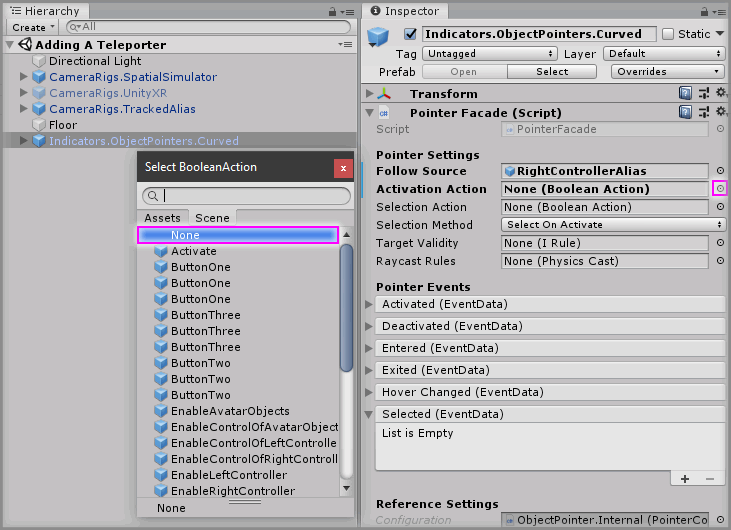
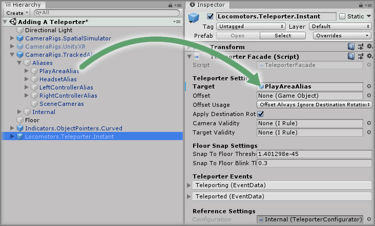
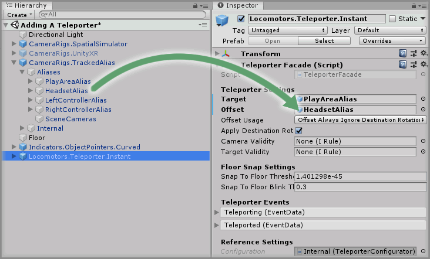
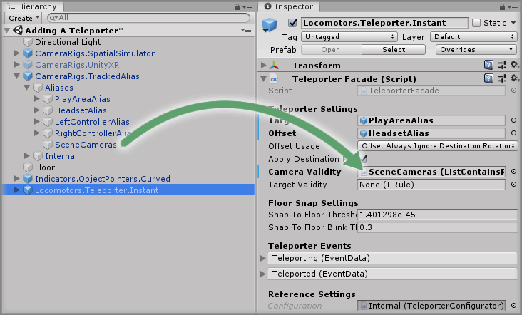
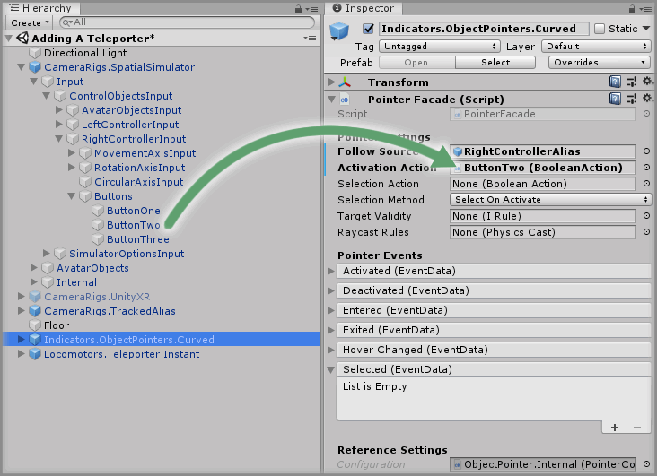
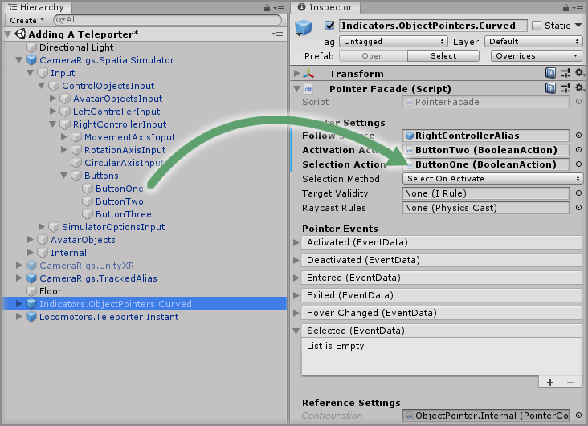
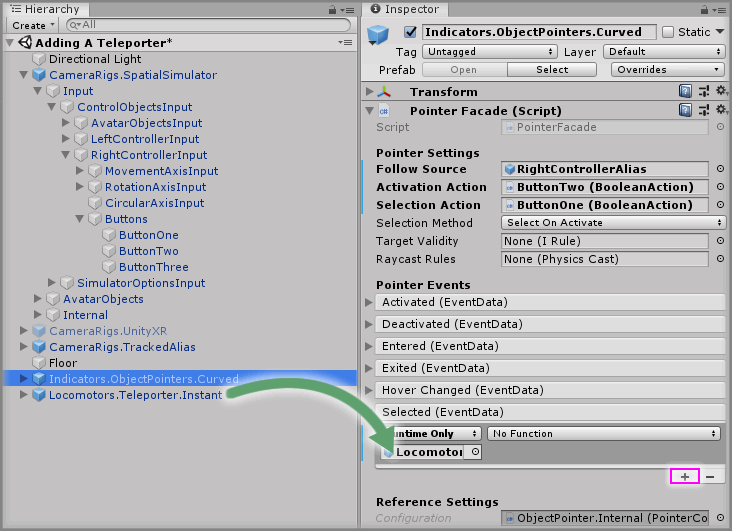
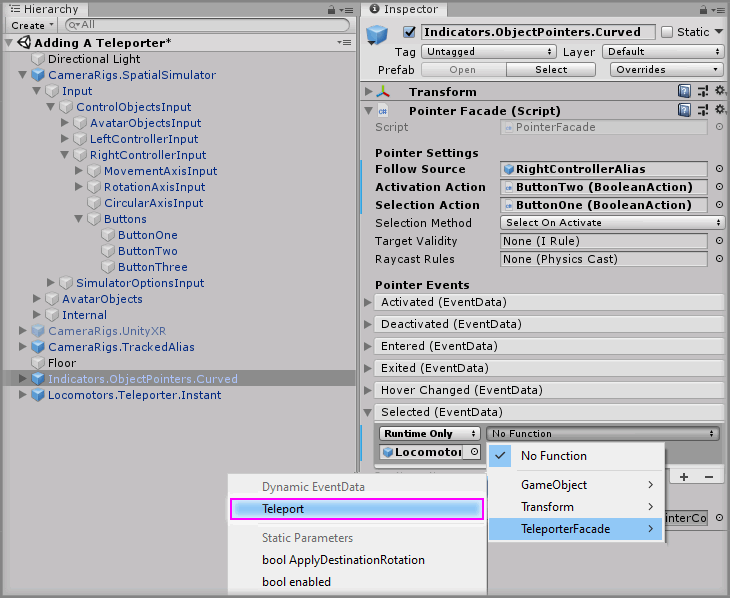

# Adding A Teleporter

> * Level: Beginner
>
> * Reading Time: 10 minutes
>
> * Checked with: Unity 2018.3.14f1

## Introduction

A popular way to move around a virtual space is via teleporting. This is the concept where the user can mark out a destination location within the virtual world and be transported to that location automatically without any further input.

There are two main types of teleporting:

`Instant` - The user specifies a destination location (e.g. marking it with a controller pointer) and then instantly appears at the destination usually with a camera fade to reduce motion sickness.

`Dash` - The user specifies a destination location and the user is gradually moved over time in a linear motion until they reach their destination location.

## Prerequisites

* [Add Tilia.Indicators.ObjectPointers.Unity -> Indicators.ObjectPointers.Curved] prefab to the scene Hierarchy.
* [Install the Tilia.Locomotors.Teleporter.Unity] package dependency in to your [Unity] project.

## Let's Start

### Step 1

Delete `Input.UnityInputManager.ButtonAction` GameObject from the Unity hierarchy then select `Indicators.ObjectPointers.Curved` GameObject and set the `Activation Action` parameter back to `none`.

### Step 2

Expand the `Tilia Locomotors Teleporter Unity` Package directory in the Unity Project window and then select `Packages -> Tilia Locomotors Teleporter Unity -> Runtime -> Prefabs` directory. Then drag and drop the `Locomotors.Teleporter.Instant` prefab into the Hierarchy window.

### Step 3

Select the `Locomotors.Teleporter.Instant` prefab in the Unity Hierarchy and change the `Teleporter Facade` component to configure the base functionality of the Teleporter.

We must specify some data so the teleporter knows what to move when we teleport and how to move it.

The `Target` parameter on the `Teleporter Facade` component determines which GameObject to actually move on the teleport method. Usually, the Camera Rig is the GameObject that we want to move as it contains our virtual player.

If the scene is set up with multiple SDK Camera Rigs due to wanting to support different hardware requirements, then you’ll see it’s not possible to assign all of these Camera Rigs to the `Target` parameter on the `Teleporter Facade` component. We also don’t want to add multiple `Locomotors.Teleporter.Instant` prefabs to the scene for each Camera Rig.

This is where the `CameraRigs.TrackedAlias` prefab helps out. The `CameraRigs.TrackedAlias` prefab provides aliases for the common virtual player GameObjects such as the Play Area, Headset and Controllers.

Expand the `CameraRigs.TrackedAlias` GameObject in the Unity Hierarchy to expose the child GameObjects then drag and drop the `CameraRigs.TrackedAlias -> PlayAreaAlias` GameObject into the `Target parameter` on the `Teleporter Facade` component.

This tells the Teleporter that when we teleport, we want to move the Play Area to the new location which will essentially move our virtual player to the new location.

> Note: Don’t set the Headset as the `Target` because this is always updated to match the real world physical Headset position so the virtual GameObject position will always be instantly override.

### Step 4

When the `Target` is teleported, the destination location will become the new central position of the `Target` GameObject. Because our virtual Play Area represents our real world Play Area, this means that if the user walks around their real world Play Area then their position is actually offset inside the Play Area.

This can have an effect when teleporting the user because the user may actually expect to end up standing exactly on the spot where they marked as the destination location. If we just move the Play Area GameObject to match the destination location then the user will still be offset from that destination location and not end up where they expected.

This diagram shows the issue in where once the user teleports from their original location, because they are not standing in the center of their Play Area then after teleporting the Play Area matches the destination location but their actual location is not exactly on the spot where they marked as the destination location.

The user may actually expect when they teleport to be standing in the exact location of the destination location and therefore their current real world position in relation to their real world Play Area needs to be taken into consideration when moving the Target.

The `Offset` parameter on the `Teleporter Facade` component helps with this situation. The `Offset` parameter determines another GameObject that can be used to describe this offset to take into consideration when moving the Target, in this case the offset is the difference between the user’s Headset position in relation to their Play Area.

So to provide this offset data to the Teleporter we simply need to drag and drop the `CameraRigs.TrackedAlias -> HeadsetAlias` GameObject into the `Offset` parameter on the `Teleporter Facade` component.

### Step 5

Both the `Locomotors.Teleporter.Instant` and `Locomotors.Teleporter.Dash` have the ability to fade the screen in and out by doing a Camera Blink whenever an instant location change occurs. This instant location change occurs on moving to the destination location for the `Locomotors.Teleporter.Instant` prefab and in both prefabs when the Teleporter snaps to the nearest floor to prevent the user walking out into space above a valid floor.

To perform this Camera Blink, the Teleporter needs to know about the cameras in the scene to apply the fade to. The `Camera Validity` parameter on the `Teleporter Facade` component allows us to specify a simple way of linking this up. The `CameraRigs.TrackedAlias` prefab contains a `Rule` of all known scene cameras on the `CameraRigs.TrackedAlias -> SceneCameras` GameObject so drag and drop the `CameraRigs.TrackedAlias -> SceneCameras` GameObject into the `Camera Validity` parameter on the `Teleporter Facade` component.

### Step 6

Now we have a fully working Teleporter in the scene, we just need a way to tell the Teleporter to move to the desired destination location.

We already have a Pointer prefab in our Unity Hierarchy so there is a way of marking out a destination location on valid areas of the virtual world. We just need to hook up the Pointer prefab to tell the Teleporter prefab to move to where it is pointing.

Let’s set up the Pointer prefab in the scene so it will tell the Teleporter to teleport our user to the Pointer destination location when the `Selection Action` occurs.

For this example we will set up the pointer to use the simulator controls utilizing the mouse.

Select the `Indictors.ObjectPointers.Curved` prefab and so we can change the `Activation Action` parameter on the `Pointer Facade` component.

Expand `CameraRigs.SpatialSimulator -> Input -> Control Objects Input -> Right Controller Input -> Buttons`.

`Button Two` is the right mouse button and we'll use this to activate our pointer so drag and drop the `Button Two` GameObject into the `Activation Action` parameter on the `Pointer Facade` component.

`Button One` is the left mouse button and we'll use this to make a selection with our pointer so drag and drop the `Button One` GameObject into the `Selection Action` parameter on the `Pointer Facade` component.

### Step 7

The `Indicators.ObjectPointers.Curved` prefab will now emit the destination location data whenever the user selects with the pointer via pressing the left mouse button so all we need to do is hook up that selection event to call the Teleporter.

Click the `+` symbol in the bottom right corner of the `Selected` event parameter on the `Pointer Facade` component found on the `Indicators.ObjectPointer.Curved` GameObject.

 
 Then drag and drop the `Locomotors.Teleporter.Instant` GameObject into the box that appears and displays `None (Object)`. 
 
 

Select a `Function` to perform when the `Selected` event is emitted. For this example, select `Teleporter Facade -> Teleport` (be sure to select `Dynamic EventData - Teleport` for this example).

### Done

Play the Unity scene and press the right mouse button and the Curved Pointer will emit the beam to the destination location on the floor where you wish to be teleported to. Pressing the left mouse button will initiate the Selected event on the Curved Pointer, which in turn tells the Teleporter to teleport to the Pointer’s destination. You will now be able to teleport around the scene.

[Add Tilia.Indicators.ObjectPointers.Unity -> Indicators.ObjectPointers.Curved]: https://github.com/ExtendRealityLtd/Tilia.Indicators.ObjectPointers.Unity/tree/master/Documentation/HowToGuides/AddingACurvedPointer
[Install the Tilia.Locomotors.Teleporter.Unity]: ../Installation/README.md
[Unity]: https://unity3d.com/
